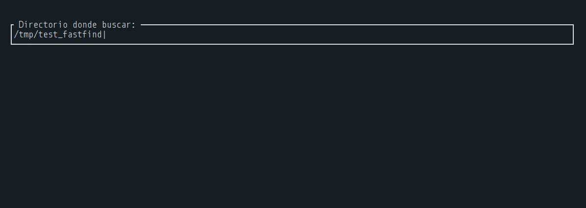
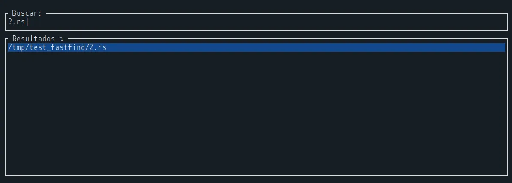
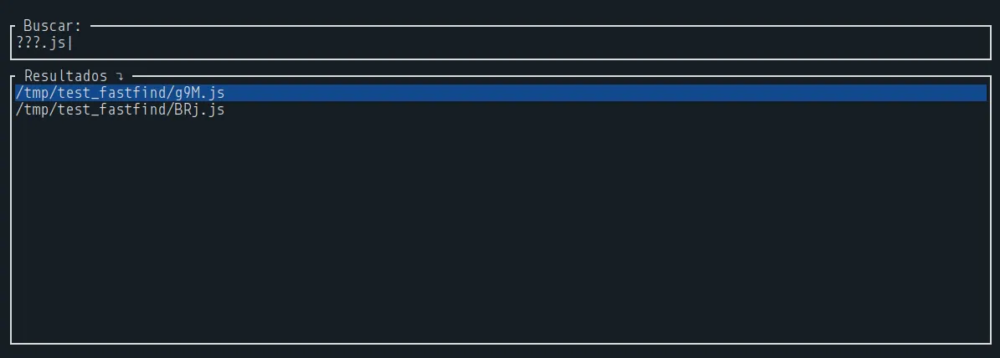
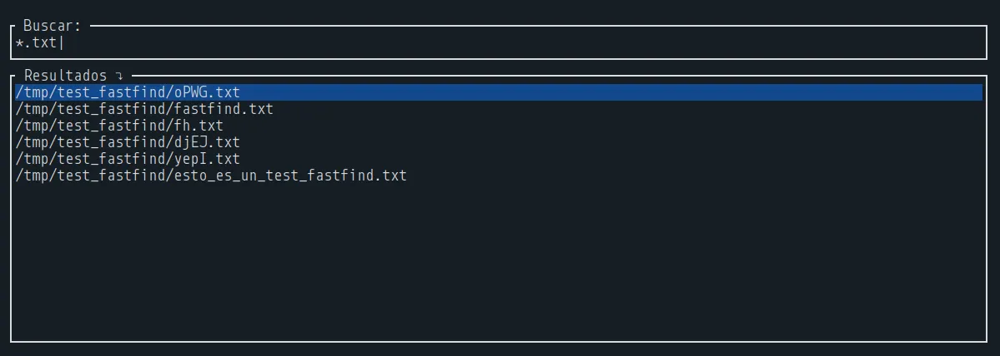
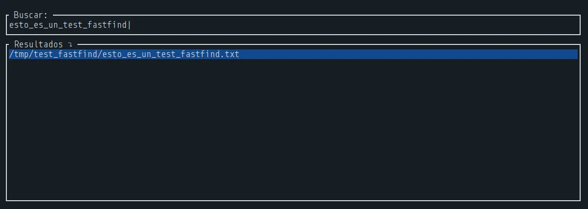
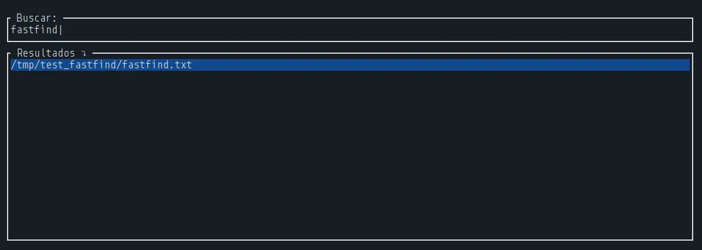
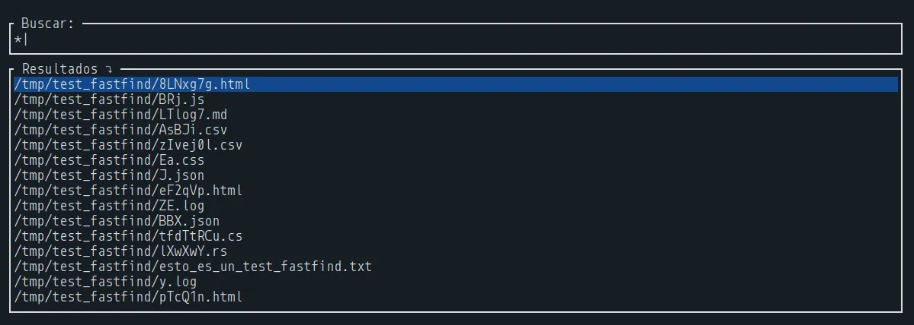

# FastFind

_Busca archivos de manera eficiente y rápida. Elige el directorio donde deseas buscar. Usa comodines para ajustar tu búsqueda. También puedes moverte por la lista usando las teclas de dirección `⬆` y `⬇`. Además, puedes abrir estos archivos haciendo `Enter`._

## Comodines:

- `*` : 0 o más caracteres
- `?` : 1 caracter ; `??` : 2 caracteres ; `???` : 3 caracteres ; etc.

## Capturas:

  
Desplegar para ver las capturas

   
  
  - Menú principal:
    
  
  > Aquí es donde escribes el directorio donde deseas realizar la búsqueda.
 

  - Buscando archivos con `1` caracter por nombre con extensión `.rs`:

  
 

  - Buscando archivos con `3` caracter por nombre con extensión `.js`:

  
 

  - Buscando todos los archivos que acaben con la extensión `.txt`:

  
 

  - Buscando archivos con nombre específico:

  
  
 

  - Mostrar todos los archivos del directorio:

  

> [!NOTE]
> **Recomendación:**
>  _Añadir FastFind como comando en tu sistema y un alias para un uso rápido._
>   
> **Ejemplo:**
>  
> `sudo ln -s ~/fastfind/target/release/fastfind ~/.local/bin/fastfind`
>   
> **Dentro de `~/.bashrc`:**
>  
> `alias ff='fastfind'`
